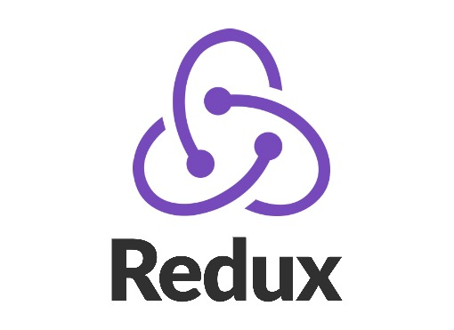

# What is redux? Quiero que me expliques que es, que beneficios tiene, cuando lo utilizarás, porque lo utilizarás. pon algún ejemplo, basa tus respuestas con ejemplos



## Uso con React

Comencemos enfatizando que Redux no tiene relación alguna con React. Puedes escribir aplicaciones Redux con React, Angular, Ember, jQuery o vanilla JavaScript.

Dicho esto, Redux funciona especialmente bien con librerías como React y Deku porque te permiten describir la interfaz de usuario como una función de estado, y Redux emite actualizaciones de estado en respuesta a acciones.

Usaremos React para crear nuestra una aplicación sencilla de asuntos pendites (To-do).

## Instalando React Redux

React Redux no está incluido en Redux de manera predeterminada. Debe instalarlo explícitamente:

```JavaScript
npm install --save react-redux
```

Si no usas npm, puedes obtener la distribución UMD (Universal Module Definition) más reciente desde unpkg (ya sea la distribución de desarrollo o la de producción). La distribución UMD exporta una variable global llamada window.ReactRedux por si la añades a tu página a través de la etiqueta < script >.

## Componentes de Presentación y Contenedores

Para asociar React con Redux se recurre a la idea de separación de presentación y componentes contenedores.  
Repasemos sus diferencias:

||Componentes de Presentación|Componentes Contenedores|
|---|---|---|
|Propósito|Como se ven las cosas (markup, estilos)|Como funcionan las cosas (búsqueda de datos, actualizaciones de estado)|
|Pertinente a Redux|No|Yes|
|Para leer datos|Lee datos de los props|Se suscribe al estado en Redux|
|Para manipular datos|Invoca llamada de retorno (callback) desde los props|Envia acciones a Redux|
|Son escritas|Manualmente|Usualmente generados por React Redux|


La mayoría de los componentes que escribiremos serán de presentación, pero necesitaremos generar algunos componentes contenedores para conectarlos al store que maneja Redux. Con esto y el resumen de diseño que mencionaremos a continuación no implica que los componentes contenedores deban estar cerca o en la parte superior del árbol de componentes. Si un componente contenedor se vuelve demasiado complejo (es decir, tiene componentes de presentación fuertemente anidados con innumerables devoluciones de llamadas que se pasan hacia abajo), introduzca otro contenedor dentro del árbol de componentes como se indica en el FAQ.

Técnicamente usted podría escribir los componentes contenedores manualmente usando store.subscribe(). No le aconsejamos que haga esto porque React Redux hace muchas optimizaciones de rendimiento que son difíciles de hacer a mano. Por esta razón, en lugar de escribir los componentes contenedores, los generaremos utilizando el comando connect(), función proporcionada por React Redux, como verá a continuación.

## Diseño de la jerarquía de componentes

Recuerda cómo diseñamos y dimos forma al objecto del estado raíz? Es hora de diseñar la jerarquía de la interfaz de usuario para que coincida con este objeto del estado. Esto no es una tarea específica de Redux. Thinking in React es un excelente tutorial que explica el proceso.

Nuestro breve resumen del diseño es simple. Queremos mostrar una lista de asuntos pendientes. Al hacer clic, un elemento de la lista se tachará como completado. Queremos mostrar un campo en el que el usuario puede agregar una tarea nueva. En el pie de página, queremos mostrar un toggle para mostrar todas las taras, sólo las completadas, o sólo las activas.

### Diseño de componentes de presentación

Podemos ver los siguientes componentes de presentación y sus props surgir a través de esta breve descripción:

- TodoList es una lista que mostrará las tareas pendientes disponibles.
    - todos: Array es un arreglo de tareas pendientes que contiene la siguiente descripción { id, text, completed }.
    - onTodoClick(id: number) es un callback para invocar cuando un asunto pendientes es presionado.
- Todo es un asunto pendiente.
    - text: string es el texto a mostrar.
    - completed: boolean indica si la tarea debe aparecer tachada.
    - onClick() es un callback para invocar cuando la tarea es presionada.
- Link es el enlace con su callback.
    - onClick() es un callback para invocar cuando el enlace es presionado.
- Footer es donde dejamos que el usuario cambie las tareas pendientes visibles actualmente.
- App es el componente raíz que representa todo lo demás.

Cada artículo describe la apariencia pero no conoce de donde vienen los datos, o cómo cambiarlos. Sólo muestran lo que se les da. Si migras de Redux a otra cosa, podrás mantener todos estos componentes exactamente iguales. No dependen de Redux en absoluto.

### Diseño de componentes contenedores

También necesitaremos algunos componentes contenedores para conectar los componentes de presentación a Redux. Por ejemplo, el componente de presentación TodoList necesita un contenedor comoVisibleTodoList que se suscribe al store de Redux y debe saber cómo aplicar el filtro de visibilidad. Para cambiar el filtro de visibilidad, proporcionaremos un componente contenedor FilterLink que renderiza un Link que distribuye la debida acción al hacer clic:

- VisibleTodoList filtra los asuntos de acuerdo a la visibilidad actual y renderiza el TodoList.
- FilterLink obtiene el filtro de visibilidad actual y renderiza un Link.
    - filter: string es el tipo del filtro de visibilidad.

### Diseño de otros componentes

A veces es difícil saber si un componente debe ser componente de presentación o contenedor. Por ejemplo, a veces la forma y la función están realmente entrelazadas, como en el caso de este pequeño componente:

- AddTodo es un campo de entrada con un botón "Añadir tarea"

Técnicamente podríamos dividirlo en dos componentes, pero podría ser demasiado pronto en esta etapa. Está bien mezclar presentación y lógica en un componente que sea muy pequeño. A medida que crece, será más obvio cómo dividirlo, así que lo dejaremos en uno solo.

## Implementación de componentes

Vamos a escribir los componentes! Comenzaremos con los componentes de presentación por lo que no es necesario pensar en la relación con Redux todavía.

### Implementación de componentes de presentación

Todos estos son componentes normales de React, por lo que no los examinaremos en detalle. Escribiremos componentes funcionales sin-estado a menos que necesitemos usar el estado local o los métodos del ciclo de duración. Esto no significa que los componentes de presentación tengan que ser funciones - es solo que es más fácil definirlos de esta manera. Si, y cuando necesites agregar un estado local, métodos de ciclo de duración u optimizaciones de rendimiento, puede convertirlos a clases.

```JavaScript
components/Todo.js
```
```JavaScript
import React, { PropTypes } from 'react'

const Todo = ({ onClick, completed, text }) => (
  <li
    onClick={onClick}
    style={{
      textDecoration: completed ? 'line-through' : 'none'
    }}
  >
    {text}
  </li>
)

Todo.propTypes = {
  onClick: PropTypes.func.isRequired,
  completed: PropTypes.bool.isRequired,
  text: PropTypes.string.isRequired
}

export default Todo
```
```JavaScript
components/TodoList.js
```
```JavaScript
import React, { PropTypes } from 'react'
import Todo from './Todo'

const TodoList = ({ todos, onTodoClick }) => (
  <ul>
    {todos.map(todo =>
      <Todo
        key={todo.id}
        {...todo}
        onClick={() => onTodoClick(todo.id)}
      />
    )}
  </ul>
)

TodoList.propTypes = {
  todos: PropTypes.arrayOf(PropTypes.shape({
    id: PropTypes.number.isRequired,
    completed: PropTypes.bool.isRequired,
    text: PropTypes.string.isRequired
  }).isRequired).isRequired,
  onTodoClick: PropTypes.func.isRequired
}

export default TodoList
```
```JavaScript
components/Link.js
```
```JavaScript
import React, { PropTypes } from 'react'

const Link = ({ active, children, onClick }) => {
  if (active) {
    return <span>{children}</span>
  }

  return (
    <a href="#"
       onClick={e => {
         e.preventDefault()
         onClick()
       }}
    >
      {children}
    </a>
  )
}

Link.propTypes = {
  active: PropTypes.bool.isRequired,
  children: PropTypes.node.isRequired,
  onClick: PropTypes.func.isRequired
}

export default Link
```
```JavaScript
components/Footer.js
```
```JavaScript
import React from 'react'
import FilterLink from '../containers/FilterLink'

const Footer = () => (
  <p>
    Show:
    {" "}
    <FilterLink filter="SHOW_ALL">
      Todos
    </FilterLink>
    {", "}
    <FilterLink filter="SHOW_ACTIVE">
      Activo
    </FilterLink>
    {", "}
    <FilterLink filter="SHOW_COMPLETED">
      Completado
    </FilterLink>
  </p>
)

export default Footer
```
```JavaScript
components/App.js
```
```JavaScript
import React from 'react'
import Footer from './Footer'
import AddTodo from '../containers/AddTodo'
import VisibleTodoList from '../containers/VisibleTodoList'

const App = () => (
  <div>
    <AddTodo />
    <VisibleTodoList />
    <Footer />
  </div>
)

export default App
```

Ahora es el momento de conectar los componentes de presentación a Redux mediante la creación de algunos contenedores. Técnicamente, un componente contenedor es sólo un componente de React que utiliza store.subscribe () para leer una parte del árbol de estado en Redux y suministrar los props a un componente de presentación que renderiza. Puedes escribir un componente contenedor manualmente, pero sugerimos generar los componentes contenedores con la función connect() de la librería React Redux, ya que proporciona muchas optimizaciones útiles para evitar re-renders innecesarios. (Un beneficio de utilizar esta librería es que usted no tiene que preocuparse por la implementación del método shouldComponentUpdate recomendado por React para mejor rendimiento.)

Para usar connect(), es necesario definir una función especial llamada mapStateToProps que indiqua cómo transformar el estado actual del store Redux en los props que desea pasar a un componente de presentación. Por ejemplo, VisibleTodoList necesita calcular todos para pasar a TodoList, así que definimos una función que filtra el state.todos de acuerdo con el state.visibilityFilter, y lo usamos en su mapStateToProps:

```JavaScript
const getVisibleTodos = (todos, filter) => {
  switch (filter) {
    case 'SHOW_ALL':
      return todos
    case 'SHOW_COMPLETED':
      return todos.filter(t => t.completed)
    case 'SHOW_ACTIVE':
      return todos.filter(t => !t.completed)
  }
}

const mapStateToProps = (state) => {
  return {
    todos: getVisibleTodos(state.todos, state.visibilityFilter)
  }
}
```

Además de leer el estado, los componentes contenedores pueden enviar acciones. De manera similar, puede definir una función llamada mapDispatchToProps() que recibe el método dispatch() y devuelve los callback props que deseas inyectar en el componente de presentación. Por ejemplo, queremos que VisibleTodoList inyecte un prop llamado onTodoClick en el componente TodoList, y queremos que onTodoClick envíe una acción TOGGLE_TODO:

```JavaScript
const mapDispatchToProps = (dispatch) => {
  return {
    onTodoClick: (id) => {
      dispatch(toggleTodo(id))
    }
  }
}
```

Finalmente, creamos VisibleTodoList llamando connect() y le pasamos estas dos funciones:

```JavaScript
import { connect } from 'react-redux'

const VisibleTodoList = connect(
  mapStateToProps,
  mapDispatchToProps
)(TodoList)

export default VisibleTodoList
```

Estos son los conceptos básicos de la API de React Redux, pero hay algunos atajos y opciones avanzadas por lo que le animamos a revisar su documentación en detalle. En caso de que que te preocupe el hecho que mapStateToProps esté creando objetos nuevos con demasiada frecuencia, quizás desees aprender acerca de computar datos derivados con reselect.

El resto de los componentes contenedores están definidos a continuación:

```JavaScript
containers/FilterLink.js
```
```JavaScript
import { connect } from 'react-redux'
import { setVisibilityFilter } from '../actions'
import Link from '../components/Link'

const mapStateToProps = (state, ownProps) => {
  return {
    active: ownProps.filter === state.visibilityFilter
  }
}

const mapDispatchToProps = (dispatch, ownProps) => {
  return {
    onClick: () => {
      dispatch(setVisibilityFilter(ownProps.filter))
    }
  }
}

const FilterLink = connect(
  mapStateToProps,
  mapDispatchToProps
)(Link)

export default FilterLink
```
```JavaScript
containers/VisibleTodoList.js
```
```JavaScript
import { connect } from 'react-redux'
import { toggleTodo } from '../actions'
import TodoList from '../components/TodoList'

const getVisibleTodos = (todos, filter) => {
  switch (filter) {
    case 'SHOW_ALL':
      return todos
    case 'SHOW_COMPLETED':
      return todos.filter(t => t.completed)
    case 'SHOW_ACTIVE':
      return todos.filter(t => !t.completed)
  }
}

const mapStateToProps = (state) => {
  return {
    todos: getVisibleTodos(state.todos, state.visibilityFilter)
  }
}

const mapDispatchToProps = (dispatch) => {
  return {
    onTodoClick: (id) => {
      dispatch(toggleTodo(id))
    }
  }
}

const VisibleTodoList = connect(
  mapStateToProps,
  mapDispatchToProps
)(TodoList)

export default VisibleTodoList
```

### Implementación de otros componentes

```JavaScript
containers/AddTodo.js
```
```JavaScript
import React from 'react'
import { connect } from 'react-redux'
import { addTodo } from '../actions'

let AddTodo = ({ dispatch }) => {
  let input

  return (
    <div>
      <form onSubmit={e => {
        e.preventDefault()
        if (!input.value.trim()) {
          return
        }
        dispatch(addTodo(input.value))
        input.value = ''
      }}>
        <input ref={node => {
          input = node
        }} />
        <button type="submit">
          Añadir tarea
        </button>
      </form>
    </div>
  )
}
AddTodo = connect()(AddTodo)

export default AddTodo
```

## Transferir al store

Todos los componentes contenedores necesitan acceso al store Redux para que puedan suscribirse a ella. Una opción sería pasarlo como un prop a cada componente contenedor. Sin embargo, se vuelve tedioso, ya que hay que enlzar store incluso a través del componentes de presentación ya que puede suceder que tenga que renderizar un contenedor allá en lo profundo del árbol de componentes.

La opción que recomendamos es usar un componente React Redux especial llamado <Proveedor> para mágicamente hacer que el store esté disponible para todos los componentes del contenedor en la aplicación sin pasarlo explícitamente. Sólo es necesario utilizarlo una vez al renderizar el componente raíz:

```JavaScript
index.js
```
```JavaScript
import React from 'react'
import { render } from 'react-dom'
import { Provider } from 'react-redux'
import { createStore } from 'redux'
import todoApp from './reducers'
import App from './components/App'

let store = createStore(todoApp)

render(
  <Provider store={store}>
    <App />
  </Provider>,
  document.getElementById('root')
)
```

----
----

# What is a SQL database? Quiero que me expliques que es, que beneficios tiene, cuando lo utilizarás, porque lo utilizarás (haz comparativa con las BBDD NoSQL) basa tus respuestas con ejemplos, así nos prepararemos para la elección en nuestros proyectos.

Una base de datos SQL es una base de datos relacional que utiliza lenguaje de consulta estructurado (SQL) para almacenar, recuperar y manipular datos. Califica como un lenguaje de programación. Las bases de datos SQL son el tipo más común de base de datos relacional y las utilizan una amplia variedad de empresas y organizaciones.

Las bases de datos de lenguaje de consulta estructurado (SQL) son fáciles de usar y mantener y tienen muchas características que las hacen adecuadas para una variedad de aplicaciones. Por ejemplo, las bases de datos SQL proporcionan lo siguiente:

- Protección de datos fiable
- Escalabilidad
- Rendimiento alto
- Facilidad de uso

## ¿Qué es una base de datos NoSQL (base de datos no relacional)?

Una base de datos NoSQL es una base de datos no relacional que no utiliza la estructura tabular tradicional de las bases de datos relacionales. Las bases de datos NoSQL se utilizan a menudo para manejar grandes cantidades de datos que no se adaptan bien al modelo relacional.

### Las bases de datos NoSQL se pueden dividir en cuatro categorías principales:

#### Tiendas de valores clave

Una base de datos NoSQL almacena datos sin un esquema como un conjunto de pares clave-valor. El valor, que puede ser cualquier cosa, desde texto simple hasta una estructura de datos más compleja, se busca por clave. Ejemplos de almacenes de valores clave son DynamoDB y Riak.

#### Tiendas orientadas a columnas

Almacenan datos en columnas en lugar de filas. Los almacenes orientados a columnas se utilizan a menudo para aplicaciones de análisis y almacenamiento de datos. Ejemplos de tiendas orientadas a columnas son Cassandra y HBase.

#### Almacenamiento de documentos

En este tipo de bases de datos NoSQL, los datos se almacenan en documentos. Los documentos se pueden estructurar de cualquier forma, lo que los hace muy flexibles. Ejemplos de almacenes de documentos son MongoDB y Couchbase.

#### Tiendas de gráficos

Estas bases de datos almacenan datos en una estructura gráfica, con nodos y bordes que conectan los datos. Los almacenes de gráficos se utilizan a menudo en aplicaciones que necesitan analizar relaciones complejas. Ejemplos de tiendas de gráficos son Neo4j y OrientDB.


## Ventajas de SQL

Las bases de datos SQL (sistemas de gestión de bases de datos relacionales) existen desde hace décadas y son las bases de datos más populares que se utilizan en la actualidad. Aquí hay algunas razones por las que las bases de datos SQL son tan populares:

1. Las bases de datos SQL son fáciles de usar. Incluso las personas sin experiencia en bases de datos pueden aprender a utilizar bases de datos SQL con un poco de formación.
2. Son muy versátiles y se pueden utilizar para cualquier propósito, desde pequeñas bases de datos personales hasta grandes bases de datos empresariales que necesitan almacenamiento de datos.
3. Las bases de datos SQL son confiables. Están diseñados para manejar grandes volúmenes de datos y transacciones sin perder ni corromper la base de datos. Si utilizan una base de datos distribuida, esto puede proporcionar seguridad. En una base de datos distribuida, bases de datos similares se encuentran en diferentes lugares.
4. Se pueden escalar. Se pueden ampliar fácilmente para dar cabida a más datos y usuarios según sea necesario. Obtienes más espacio de almacenamiento.
5. La mayoría de los principales proveedores de bases de datos admiten bases de datos SQL. Esto significa que las empresas tienen muchas opciones a la hora de elegir una base de datos SQL.
6. Cuentan con el respaldo de una sólida comunidad de desarrolladores. Esta comunidad brinda soporte y recursos para empresas e individuos que utilizan bases de datos SQL.

## SQL vs NoSQL: diferencias clave

Las bases de datos SQL y NoSQL son los dos tipos de bases de datos más populares. Ambos son poderosos y valiosos a su manera. Aquí están las principales diferencias:

- Las bases de datos SQL son bases de datos relacionales. Esto significa que los datos se organizan en tablas y cada tabla tiene una estructura específica. Las tablas están relacionadas entre sí a través de relaciones. Esto hace que las bases de datos SQL sean muy poderosas para almacenar datos a los que se debe acceder de una manera específica.
- Las bases de datos NoSQL son bases de datos no relacionales. Esto significa que los datos se almacenan como un conjunto de documentos. Estos documentos no tienen una estructura específica y no están relacionados entre sí. Por tanto, son más adecuados para almacenar datos a los que no es necesario acceder de una forma específica.
- Una de las principales diferencias entre las bases de datos SQL y NoSQL es cómo escalan. Las bases de datos SQL utilizan escalamiento vertical, lo que significa que escalan aumentando la potencia del servidor. Las bases de datos NoSQL escalan horizontalmente, lo que significa que escalan agregando más servidores.
- Otra diferencia es que las bases de datos SQL suelen ser más caras de mantener que las bases de datos NoSQL. Las bases de datos SQL requieren más administración, como crear y mantener índices y vistas. Las bases de datos NoSQL suelen ser menos costosas porque requieren menos administración.
- Las bases de datos SQL también suelen ser más complejas que las bases de datos NoSQL. Esto se debe a que las bases de datos SQL deben seguir reglas ACID (atomicidad, consistencia, aislamiento y durabilidad), lo que puede hacerlas más lentas y complejas. Por otro lado, las bases de datos NoSQL suelen ser más simples y pueden ser más rápidas ya que no necesitan seguir reglas ACID.

### Reglas de SQL ACID:

ACID significa Atomicidad, Consistencia, Aislamiento y Durabilidad. En resumen, esto significa que los datos se almacenan de forma segura y confiable, y que las transacciones se procesan de manera confiable y consistente. NoSQL, por otro lado, no sigue las reglas ACID. Esto significa que es más flexible a la hora de almacenar y procesar datos. Sin embargo, esto también significa que los datos no siempre se almacenan de manera confiable y segura, y que el procesamiento de transacciones puede ser poco confiable e inconsistente.

Entonces ¿cuál es mejor? Depende de tus necesidades. Si necesita una base de datos flexible que pueda manejar grandes cantidades de datos, NoSQL es una buena opción. Si necesita una base de datos confiable y consistente, SQL es una mejor opción. Si necesita una base de datos que sea fácil de consultar y escalable verticalmente, entonces una base de datos SQL es su mejor opción. Si desea una base de datos que se pueda escalar horizontalmente fácilmente y que no requiera mucho mantenimiento, entonces una base de datos NoSQL es su mejor opción.

## MongoDB frente a MySQL

MongoDB y MySQL son opciones populares en el mundo de las bases de datos.


- MongoDB es una base de datos orientada a documentos que es fácil de escalar. Utiliza documentos tipo JSON con esquemas dinámicos, lo que facilita el almacenamiento y la consulta de datos. También es adecuado para datos no estructurados, como archivos de registro y datos de redes sociales.
- MySQL es una base de datos relacional que es más difícil de escalar. Utiliza un esquema fijo, lo que dificulta el almacenamiento y la consulta de datos. Sin embargo, MySQL es una buena opción para datos estructurados como datos financieros. En términos de rendimiento, MongoDB es generalmente más rápido que MySQL. También es más escalable que MySQL.
- En términos de facilidad de uso, MongoDB es más fácil de usar que MySQL.

MongoDB es una buena opción si necesita una base de datos rápida y escalable para datos no estructurados. MySQL es adecuado si necesita una base de datos relacional para datos estructurados.

## La nube y el futuro de SQL y NoSQL

La nube se ha convertido en una parte integral de nuestra vida personal y profesional. No es fácil imaginar un mundo sin él. La nube nos ha permitido acceder a información y aplicaciones en cualquier lugar y en cualquier momento. También nos permitió almacenar y compartir datos de manera más eficiente. Simplificó el almacenamiento de datos.

La nube ha tenido un impacto significativo en el mundo de las bases de datos. En el pasado, la mayoría de las empresas utilizaban bases de datos relacionales como SQL. Sin embargo, la nube también ha permitido a las empresas utilizar bases de datos NoSQL. Las bases de datos NoSQL son menos rígidas y más escalables que las bases de datos SQL. También son más adecuados para trabajar con big data.

## Ejemplos de bases de datos SQL

Las bases de datos SQL son una de las bases de datos más comunes del mundo y utilizan múltiples lenguajes SQL. Se utilizan en una variedad de aplicaciones, desde pequeñas empresas hasta grandes empresas.

Son fáciles de usar y muy flexibles. Las empresas pueden utilizarlos para almacenar, manipular y recuperar datos.

Existen muchos tipos diferentes de bases de datos SQL, pero las más comunes son MySQL, Microsoft SQL Server, MariaDB y Oracle.

MySQL es una base de datos gratuita y de código abierto popular entre las pequeñas empresas y las aplicaciones web.

Microsoft SQL Server es una base de datos comercial utilizada por grandes organizaciones. Oracle también es una base de datos comercial.

## Ejemplos de bases de datos NoSQL

MongoDB es una base de datos NoSQL popular. Es una base de datos orientada a documentos, fácil de usar y escalable. MongoDB también es muy flexible y le permite almacenar una amplia gama de tipos de datos. Pueden trabajar con big data.

Cassandra es otra base de datos NoSQL popular. Es una base de datos orientada a columnas que está diseñada para alta disponibilidad y escalabilidad. Cassandra se utiliza a menudo para almacenar grandes cantidades de datos.

HBase es una base de datos orientada a columnas construida sobre el sistema de archivos Hadoop. HBase está diseñado para brindar escalabilidad y rendimiento. HBase se utiliza a menudo para el análisis de datos en tiempo real.

Redis es una sólida base de datos en memoria que se utiliza a menudo para el almacenamiento en caché. Redis es rápido y puede usarse para muchas aplicaciones.

Las bases de datos NoSQL se están volviendo cada vez más populares a medida que crece la necesidad de escalabilidad y flexibilidad. Existen varios tipos de bases de datos NoSQL, cada una con sus propias fortalezas y debilidades.

## Cuándo utilizar SQL frente a NoSQL para su negocio

No existe una respuesta única sobre cuándo utilizar SQL o NoSQL para su negocio. La decisión de qué tecnología de base de datos utilizar depende de varios factores, incluida la naturaleza de los datos, los requisitos de rendimiento, los requisitos de escalabilidad y el presupuesto.

Algunas empresas claramente preferirán una tecnología de base de datos sobre otra. Por ejemplo, las empresas que trabajan con grandes volúmenes de datos estructurados pueden encontrar que las bases de datos SQL son más adecuadas. Por otro lado, las empresas que necesitan escalar rápidamente y trabajar con grandes volúmenes de datos no estructurados pueden decidir que las bases de datos NoSQL son la mejor opción.

Es posible que otras empresas necesiten utilizar bases de datos SQL y NoSQL para aprovechar al máximo sus datos. Por ejemplo, una empresa podría utilizar una base de datos SQL para datos transaccionales y una base de datos NoSQL para análisis.

La conclusión es que no existe una respuesta correcta o incorrecta al elegir entre bases de datos SQL y NoSQL.

----
----

# Why do we use MySQL Workbench? ¿qué es? existen otros?, si es así hazme una comparativa en tabla con beneficios y desventajas

El programa MySQL Workbench está desarrollado por Oracle y te permite administrar remotamente tus bases de datos desde tu ordenador.

Puedes descargar MySQL Workbench desde la página oficial de MySQL. Una vez descargues el programa, sigue los pasos de instalación para instalar correctamente el programa en tu ordenador.

Antes de conectar a tu base de datos de MySQL, tienes que permitir el acceso al servidor a tu dirección IP. Puedes ver más información al respecto en la siguiente guía.

## Establecer una conexión a tu cuenta

Cuando la instalación del programa esté lista y hayas permitido el acceso a tu cuenta desde tu dirección IP, abre el programa de MySQL Workbench. Verás una página de bienvenida con información general sobre el programa y enlaces a varios recursos.

Necesitarás añadir una nueva conexión, que puede hacerse haciendo clic en el botón + al lado de la línea MySQL Connections.


Esto abrirá una nueva ventana llamada Setup New Connection donde tendrás que rellenar la información correspondiente a tu cuenta:

- Connection Name: indica el nombre de la conexión deseada;
- Connection Method: deja la opción por defecto – Standard (TCP/IP);
- Hostname: aquí coloca la IP de tu cuenta.
- Port: deja el que viene por defecto: 3306;
- Username: tu usuario;
- Default Schema: déjalo en blanco.

Puedes utilizar el botón de Test Connection para probar si los ajustes utilizados son correctos.


Al probar la conexión se te pedirá una contraseña. Proporciona la contraseña y haz clic en el botón OK para confirmar.


Si la conexión se establece con éxito, verás una notificación al respecto.


Guarda la conexión haciendo clic en el botón OK. Después, en la ventana principal del programa MySQL Workbench verás una conexión en la línea MySQL Connections. Haz doble clic en ella para establecer la conexión a tu cuenta de alojamiento y empezar a administrar tus bases de datos.


## Cómo crear y restaurar copias de seguridad

Cuando abras una conexión a tu cuenta verás una nueva ventana con diferentes herramientas que puedes utilizar. Puedes utilizar estas herramientas para crear y restaurar copias de seguridad.

Para crear una copia de seguridad de una base de datos de tu cuenta a tu ordenador, puedes utilizar la herramienta de Data Export en la columna de la izquierda.


Cuando accedas a esta herramienta, verás una lista con todas las bases de datos asociadas a tu cuenta. Utiliza el marcador al lado de cada una de ellas para elegir las que quieres crear la copia de seguridad. Después establece una ruta a donde las bases de datos se exportarán en el campo de Export to Dump Project Folder, que exportará cada tabla de manera separada en su propio archivo o elige la opción de Export to Self-Contained File para crear una copia de seguridad completa de la base de datos en un único archivo. Una vez listo, haz clic en el botón de Start Export para iniciar el proceso de exportación.


El proceso de exportación empezará y puedes seguir su progreso desde la ventana que se abrirá.


El proceso de restauración de una base de datos es bastante similar y puedes realizarlo desde la herramienta de Data Import. elige la ruta desde donde las tablas se importarán en el campo de Import from Dump Project Folder o utiliza la opción de Import From Self-Contained File si tienes una copia .sql de la base de datos.


## Cómo hacer una petición (query) de la base de datos

Puedes utilizar el programa MySQL Workbench para realizar peticiones de MySQL hacia la base de datos de tu cuenta. Para ello, primero elige la base de datos desde la columna de la parte izquierda haciendo doble clic en ella.


Después escribe la petición de MySQL que quieres ejecutar en el campo de texto en el medio de la ventana del programa, y utiliza el botón con forma de rayo amarillo encima del campo de texto para ejecutar la petición.


El programa ejecutará la petición y verás los resultados al final de la ventana.

----
----

# What are some SQL Data Types? pon ejemplos y explica en que casos los utilizaríamos


### Números enteros

- TINYINT es un tipo de números enteros. Rango de valores de -127 a 128 (si puede ser negativo), o 0 a 255 (si no puede ser negativo).
- SMALLINT es un tipo de enteros, A diferencia de TINYINT, el rango de valores es significativamente mayor: -32 768 a 32 767 (si el valor puede ser negativo), o 0 a 65 535.
- MEDIUMINT es un tipo de enteros, sin embargo, el rango de valores es aún mayor: de -8 388 608 a 8 388 607 (si es posible negativo), o de 0 a 16 777 215.
- INT es un tipo de números enteros. El tipo de datos más común. Rango: de -2 147 483 648 a 2 147 483 647, o de 0 a 4 294 967 295.
- BIGINT es otro tipo de números enteros, con el rango de valores más amplio. Rara vez se utiliza, ya que una escala similar de valores es extremadamente rara. De -9 223 372 036 854 775 808 a 9 223 372 036 854 775 807, o de 0 a 18 446 744 073 709 551 615.

### Números reales

- FLOAT - números reales. La precisión es única. El número de signos después de la coma no puede ser superior a 24 horas. Rango de valores: de -3,402823466E + 38 a -1,175494351E-38, 0, y de 1,175494351E-38 a 3,402823466E + 38.
- DOUBLE es un tipo real de datos. Es similar a FLOAT, pero los signos después de coma son el doble. El número de signos después de la coma puede ser de hasta 53 x. Valores permitidos: -1,7976931348623157E + 308 a -2,2250738585072014E-308, 0, y de 2,2250738585072014E-308 a 1,7976931348623157E + 308.
- DECIMAL es un tipo de datos real, almacenado como una cadena. Se usa raramente. Si no hay signos, el rango de valores es el mismo que el de DOUBLE.

### Las líneas

- TEXT (BLOB) es un tipo de datos de cadena estándar. Longitud máxima de 65.535 caracteres.
- TINYTEXT (TINYBLOB) es un tipo de cadena. Texto con una longitud de 0 a 255 caracteres.
- MEDIUMTEXT (MEDIUMBLOB) es un tipo de cadena. Texto con una longitud de 0 a 16.777.215 caracteres.
- LONGTEXT (LONGBLOB) es un tipo de cadena. Texto con una longitud de 0 a 4 294 967 295 caracteres.
- VARCHAR es otro tipo de datos de cadena, con una cadena de longitud variable de 0 a 255 caracteres. Se utiliza con mayor frecuencia para guardar variables con login, contraseña y otros datos de usuario.
- CHAR es un tipo de datos de cadena. La longitud es fija (independientemente del número de caracteres transferidos). El rango es de 0 a 255 caracteres. Cuando los datos se transmiten con menos de 255 caracteres al final, los espacios se completan con los datos para que la longitud de la cadena alcance el tamaño especificado.

### Tipos de datos binarios

- TINYBLOB es un tipo de datos binarios. Máximo 255 caracteres.
- BLOB es un tipo binario. Máximo 65535 caracteres.
- MEDIUMBLOB es un tipo de datos binarios. Máximo 16.777.215 caracteres.
- LONGBLOB es un tipo de datos binarios. Máximo 4 294 967 295 caracteres.

### Fecha y hora

- DATE: tipo de datos que almacena la fecha. El formato es el siguiente: YYYY-MM-DD (año, mes, día). Por ejemplo, tal valor satisfaría este campo: 2011-01-02.
- DATETIME es un tipo de datos que almacena la fecha y la hora. El formato es el siguiente: YYYY-MM-DD HH: MM: SS (año-mes-día hora-minuto-segundo). Por ejemplo: 2011-01-21 09:41:22
- TIMESTAMP es un tipo de datos que almacena la fecha y la hora. Tiene los siguientes formatos: YYYYMMDDHHMMSS, YYMMDDHMMMSS, YYYYMMDD, YYMMDD.
- TIME es el tipo de datos que almacena el tiempo. Formato: HH: MM: SS. Por ejemplo: 09:21:55.
- YEAR: tipo de datos que almacena la fecha (año). Formatos: YY, YYYY.